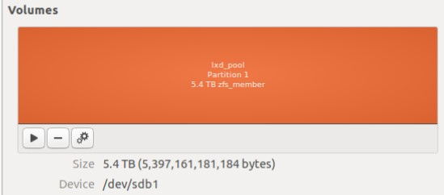
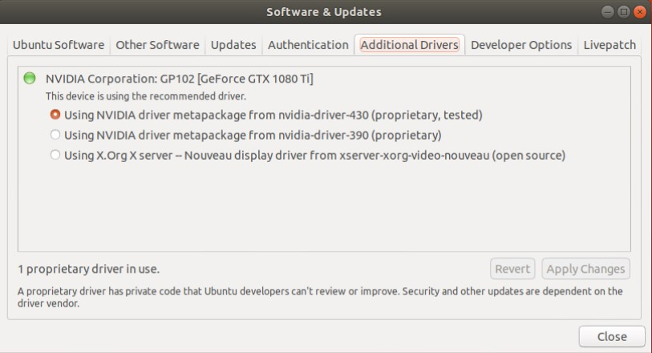
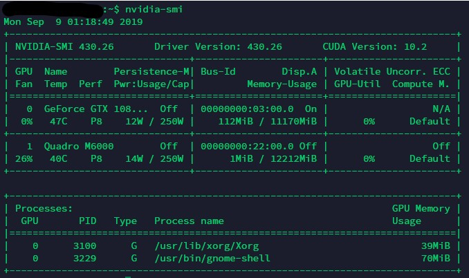
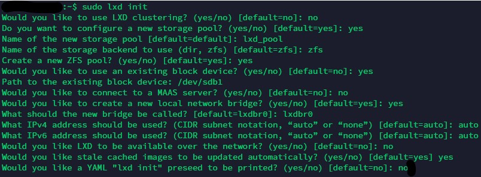
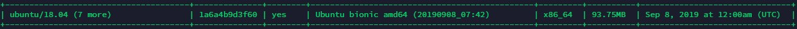
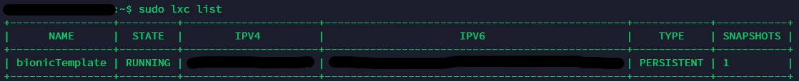
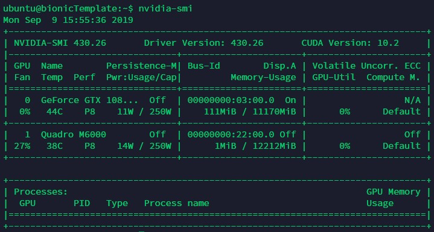
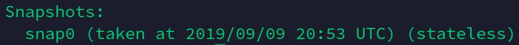

## Preface
___
Our lab recently purchased a few GPUs and I am tasked with installing them on a workstation. After some research on the web, I decided to go with the LXD container solution, offering nice features such as container isolation, access to GPUs, instant deployment and control over resources.
<!-- more -->

Note - all <...> in this article are to be replaced with actual content in installation and configuration unless stated otherwise. For example, \<your ip> would be replaced as 198.12.2.1, that is, your ip.

## Table of Content
<!-- toc -->

## System and Driver Installation
___
### Linux Installation
I chose to use Ubuntu 18.04 (Bionic Beaver) as the host system as it defaults to installing LXD 3.0, which supports GPUs in containers. The installation itself is trivial, one thing to note however is that during or after installation, we need to create a ext4 partition that is not mounted to anything, and note down its block name (normally /dev/sdax,/dev/sdbx, etc) as we will need this space to store the containers later. The screenshot below is a 5TB HDD in one partition (this is where containers are stored).


### GPU Driver Installation
Next comes the installation of the GPU driver - and it seems that the easiest way is to install through the `Software & Updates` application in Ubuntu. Reboot after finishing installation.


After reboot, type `nvidia-smi` to check the version of the installed driver. Note it down for future use in the containers.
 

&nbsp;

## LXD Installation and Configuration
___
### LXD Installation
In terminal, install the required packages,
```terminal
sudo apt-get install lxd zfsutils-linux bridge-utils
```
* lxd : the container software  
* zfsutils-linux : disk management  
* bridge-utils : bridge the internet to containers

### LXD Configuration
In terminal, initilize LXD,
```terminal
sudo lxd init
```
The configuration follows the screenshot below

The two things that are not default are :  
*  Would you like to use an existing block device? (yes/no) [default=no]: yes  
* Path to the existing block device: /your/partition

One thing to note - If your disk/partition is currently formatted and mounted on the system, it will need to be unmounted with `sudo umount /path/to/mountpoint` before continuing, or LXD will error during configuration. Additionally if there’s an `fstab` entry this will need to be removed before continuing, otherwise you’ll see mount errors when you next reboot.<sup id="a1">[1](#beaware)</sup>  
  
&nbsp;

## Creating the Template
___
### Downloading the Image and Creating a Container
In terminal, list the available images,
```terminal
sudo lxc image list images:
```
Find the `ubuntu/18.04 (7 more)                | 1a6a4b9d3f60 | yes    | Ubuntu bionic amd64 (20190908_07:42)         | x86_64  | 93.75MB  |` entry, the second column `1a6a4b9d3f60` represents the fingerprint of the image.  

To download the image and launch the container, in terminal run
```terminal
sudo lxc launch images:<FINGERPRINT> <ContainerTemplateName>
```
 \<FINGERPRINT> is the second column mentioned above and \<ContainerTemplateName> is what you want to call the container. In this instance I chose bionicTemplate.  
 * Use `sudo lxc list` to see the images
 
 * Use `sudo lxc exec <ContainerTemplateName> bash` to access the root bash of the container. Switch to standard user `ubuntu` using `su ubuntu`  
 * Note - if the container throws the error `sudo: no tty present and no askpass program specified`, then edit the file `/etc/sudoers`, and add `ubuntu ALL=(ALL) NOPASSWD:ALL` to the end of the file<sup id="a2">[2](#notty)</sup>.  

### Creating Shared Directory and Sharing the GPU
#### Shared Directory Configuration
This is for R/W within the container. If only read permission is suffientm just run
```terminal
# Set shared directory，<shareName> is the virtual device name of your wish, <path1> is the shared directory under the host，<path2> is the shared directory under the container that already exsists

sudo lxc config device add <ContainerTemplateName> <shareName> disk source=<path1> path=<path2>
```

In terminal, run 
```terminal
# Allow the LXD demon (running as root) to remap our host's user ID inside a container - one time step

echo "root:$UID:1" | sudo tee -a /etc/subuid /etc/subgid

# Stop the container 

sudo lxc stop <ContainerTemplateName>

# Remap the UID inside the container - need to do for every container created

sudo lxc config set <ContainerTemplateName>  raw.idmap "both $UID 1000"

# Give the container elevated privileges

sudo lxc config set <ContainerTemplateName> security.privileged true

# Set shared directory，<shareName> is the virtual device name of your wish, <path1> is the shared directory under the host，<path2> is the shared directory under the container that already exsists

sudo lxc config device add <ContainerTemplateName> <shareName> disk source=<path1> path=<path2>

# Start the container 

sudo lxc start <ContainerTemplateName>

# (Optional)  Access the standard user of the container
sudo lxc exec <ContainerTemplateName> bash

su ubuntu
```

#### Shared GPU Configuration
In terminal, run one of the two commands below,
```terminal
# Give container access to all GPUs

sudo lxc config device add <ContainerTemplateName> gpu gpu

# Give container access to selected GPU 

sudo lxc config device add <ContainerTemplateName> gpu0 gpu id=0
```
Now we look back on the host's GPU driver version that we noted down before, download it from the website or wget it from the terminal, version 430.26 is linked [here](http://us.download.nvidia.com/XFree86/Linux-x86_64/430.26/NVIDIA-Linux-x86_64-430.26.run) for convenience, you can also run 
```terminal
wget http://us.download.nvidia.com/XFree86/Linux-x86_64/430.26/NVIDIA-Linux-x86_64-430.26.run
```
but please adapt your own version depending on your drivers. 

Installing the driver inside the container is rather simple, just run
```terminal
# Access the bash

sudo lxc exec <ContainerTemplateName> bash

# Go to the directory where the driver installation file is kept

cd /driver/installation/file/directory

# Install the driver without kernel

sudo sh NVIDIA-Linux-x86_64-xxx.xx.run --no-kernel-module
```
After installation, use `nvidia-smi` to check that it is successful. Notice here that the account is ubuntu and the hostname is bionicTemplate.


&nbsp;

## Container SSH Access
___
### Configuring SSH login
In terminal, install `openssh-server`
```terminal
# install

sudo apt install openssh-server

# check service

sudo systemctl status ssh

# if it is not Active: active (running), run

sudo systemctl enable ssh
sudo systemctl start ssh
```
As our server in in the university network, I did not go over the hassle of 
configuring firewalls. If you want to, here is an excellent [tutorial](https://www.digitalocean.com/community/tutorials/how-to-set-up-a-firewall-with-ufw-on-ubuntu-18-04) by Digital Ocean.  

Next we configure the ssh keys. In the terminal of the container, run
```terminal
cd ~/.ssh

# Set the password to the key at your will

ssh-keygen -t rsa
sudo cat id_rsa.pub >> authorized_keys
sudo service ssh restart
```
### Testing SSH
In the container terminal, run `ifconfig` (if it errors run `sudo apt install net-tools` first), note down the ip address. Do the same thing for the host, but this time note down the ip adress for lxdbr0.

Next, copy the SSH private key id_rsa to the host through the shared directory that we set up earlier. After copied, put it in a safe place, then in the host terminal, run
```terminal
# set permissions to read-only to prevent accidental overwrites, you can also rename it to anything you want

sudo chmod 400 id_rsa

# SSH login

ssh -i id_rsa ubuntu@<the ip of container>
```
Check that we can log in successfully.

&nbsp;

## Container Remote Access Through frp
___
### Why this part?
The reason is though we have successfully configured SSH login, it could only be done on the host machine - which defeats the purpose of this article. Thus we need to configure it such that the connection can "pass through" the host and remote machines can access it. frp is an excellent tool for this purpose. Below is a graph to illustrate the process from their GitHub<sup id="a3">[3](#frp)</sup>.
  

### Installing frp
Download the latest release from [here](https://github.com/fatedier/frp/releases), unzip it to `/opt/`, and the path should be `/opt/frp_x.xx.x_linux_amd64/`. The files of interest are:
* frps.ini : server configuration (for host)
* frps : server executable
* frpc.ini : client configuration (for containers)
* frpc : client executable

### Configuring frp
Edit the frps.ini in the host machine
```ini
[common]
# port of your choice
bind_port = 7000 
# restric ports for better management
allow_ports = 2000-3000
```
Edit the frpc.ini in the container
```ini
[common]
# IP of host on lxdbr0
server_addr = <host IP of lxdbr0> 
# bind_post of host
server_port = <bind_port from frps.ini of host>

# an instance, notice the name in [] should be different for different containers
[name]
type = tcp
local_ip = 127.0.0.1
local_port = 22
# the mapped port on the host
remote_port = <port of your choice>
```
### Configuring frp to auto start when booting the host and launching the container
Next we configure frp server (the host) such that it starts automatically.
```terminal
sudo vim /lib/systemd/system/frps.service
```
Populate it with 
```service
[Unit]
Description=fraps service
After=network.target network-online.target syslog.target
Wants=network.target network-online.target

[Service]
Type=simple

#command to start frp server
ExecStart=/opt/frp_x.xx.x_linux_amd64/frps -c /opt/frp_x.xx.x_linux_amd64/frps.ini

[Install]
WantedBy=multi-user.target
```
Then run
```terminal
sudo systemctl enable frps
sudo systemctl start frps
``` 

It is nearly the same with the frp client (the container).
```terminal
# this is in the container

sudo vim /lib/systemd/system/frpc.service
```
Populate it with 
```service
[Unit]
Description=fraps service
After=network.target network-online.target syslog.target
Wants=network.target network-online.target

[Service]
Type=simple

#command to start frp client
ExecStart=/opt/frp_x.xx.x_linux_amd64/frpc -c /opt/frp_x.xx.x_linux_amd64/frpc.ini

[Install]
WantedBy=multi-user.target
```
Then run
```terminal
sudo systemctl enable frpc
sudo systemctl start frpc
```
### Connection
```terminal
ssh -i <private key>  -p <remote_port of container frpc> <username, typically ubuntu>@<ip of host>
```
&nbsp;

## Creating & Deploying New Containers
___
After creating the template, we can now simply copy it and deploy it.
```terminal
# create new container

sudo lxc copy <ContainerTemplateName> <newContainerName>
sudo lxc start <newContainerName>
sudo lxc exec <newContainerName> bash
su ubuntu

# configure new SSH

cd ~/.ssh/
ssh-keygen -t rsa
cat id_rsa.pub >> authorized_keys
sudo service ssh restart
sudo cp id_rsa /your/shared/directory/

# change hostname

sudo vim /etc/hostname

# change the old hostname (the one after 127.0.0.1) to the new one, see screenshot below

sudo vim /etc/hosts

# change the [name] and remote_port of frpc.ini to a different one
sudo vim /opt/frp_x.xx.x_linux_amd64/frpc.ini

# reboot to take effect

sudo reboot
```
Take a snapshot,
```terminal
sudo lxc snapshot <ContainerName>
```
To check the name of the snapshot,
```terminal
sudo lxc info <ContainerName>
```


To restore,
```terminal
sudo lxc restore <ContainerName> <snapshot-name>
```
&nbsp;

## Sources
___
These sources helped me immensely in this project. Many thanks to these kind people, especially Shen<sup id="a4">[4](#gpu-server-lab)</sup> and Ewen<sup id="a5">[5](#frp-service)</sup>
 
<a name="beaware">1</a> : [Be Aware](https://bayton.org/docs/linux/lxd/lxd-zfs-and-bridged-networking-on-ubuntu-16-04-lts/#be-aware) [↩](#a1)  
<a name="notty">2</a> : [Sudo Issue](https://askubuntu.com/questions/1113503/ubuntu-18-04-sudo-no-tty-present-and-no-askpass-program-specified) [↩](#a2)  
<a name="frp">3</a> : [frp](https://github.com/fatedier/frp) [↩](#a3)  
<a name="gpu-server-lab">4</a> : [gpu-server-lab](https://shenxiaohai.me/2018/12/03/gpu-server-lab/) [↩](#a4)  
<a name="frp-service">5</a> : [frp-service](https://blog.csdn.net/sinat_29963957/article/details/83591264) [↩](#a5)  


